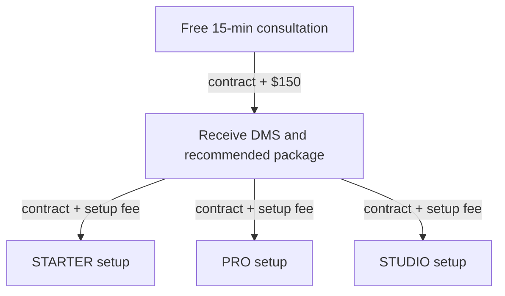

#dmcs
# Timeline

# Testimonials

> [!quote]- Jay Simms, Rux Media
> *like all this data stuff for companies is so crucial* 
> *And its like trying to learn math in school where you get the concept but the harder you tryi to think about it, the more it slips* 
> *Everyone knows “about” VPNs and data storage AND the imporatacne but they can’t just grasp it*
> *And you’re coming in with the fucking test answers* 
> *Thats my quote for the website* 
> 
> — Jay Simms, Rux Media

# CTA

> [!quote]- CTA
> **Stray Frames Infrastructure Solutions** offers scalable, white-glove data infrastructure consulting for video professionals—from indie creators to in-house brand teams. Our solutions standardize secure, high-performance storage and remote workflows, solving the most common post-production bottlenecks: lost data, disorganized drives, and unscalable backup strategies. We deliver **templated systems for reliability**, and offer **custom engineering for teams with complex or evolving needs**.
> 
> Good phrasing to use:
> - I want to be the architect of their data workflow